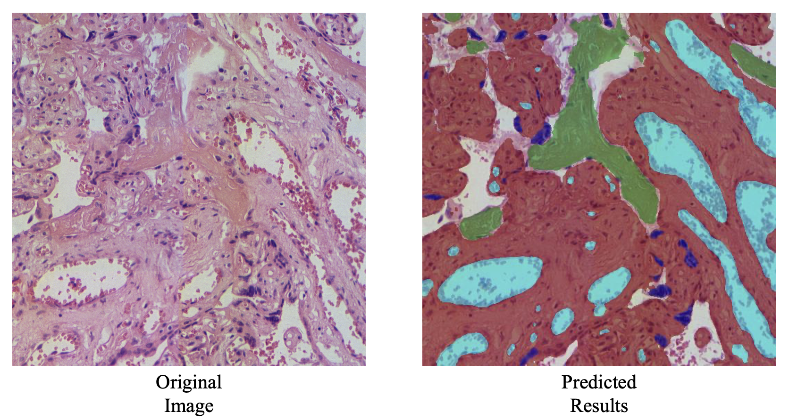

# Multi-model Fusion and Distillation
[]() []()

> [Inspect quantitative signals in placental histopathology: Computer-assisted multiple functional tissues identification through multi-model fusion and distillation framework](https://doi.org/10.1016/j.compmedimag.2024.102482)
>
> Yiming Liu, Ling Zhang, Mingxue Gu, Yaoxing Xiao, Ting Yu, Xiang Tao, Qing Zhang, Yan Wang, Dinggang Shen, Qingli Li
>
> December 2024, Computerized Medical Imaging and Graphics

This paper proposes a <u>m</u>ulti-<u>m</u>odel <u>f</u>usion and <u>d</u>istillation framework **(MMFD)** which is capable of integrating multiple model encoders with various spatial resolutions and channel numbers. By fusing multiple models, such as domain expert models and fundation models, model blindness [1] is alleviated and visual embeddings are enhanced.

**Note that this method can enhance performance with decreased model parameters and increased inference speed!**

- WSI-level segmentation results of placental multiple functional tissues are as follows. (Medical impact: Our method can boost quantitative assessment of placental histopathology.)


- Architecture of MMFD


## Installation

Please see [INSTALL.md](INSTALL.md).

## Quickstart by Visualizing

We provide the checkpoint for downloading and a script for visualization. You can try this model for analyzing placental histopathology quantitatively.

The checkpoint comes from the MMFD model with fusion of MedSAM [2], PLIP [3] and PiDiNet [4] and distillation.

- The config file is documented at  ` configs/multimodel2s_distill-pidinet-plip-d2t512-iter5k-b8-lr0001.yaml` .

- **The** checkpoint can be downloaded [here](https://drive.google.com/file/d/1Urd6ZRWhuNUDZHbCBXXJ1xGaayhJv50K/view?usp=drive_link).

- An example image of placental histopathology is documented [here](readme/example.jpg).

To visualize the segmentation results, simply run:

```shell
python visualize_net.py --cfg_file $config_file --img_path $img_path --ckpt_path $ckpt_path
```

**Results** should be similar as follows:


## Data Structure

The meta data of dataset like `dataset_dir` is registered in `lib/datasets/dataset_catalog.py`. 

Our PMFT dataset is denoted as `placenta_dataset` in codes.

The dataset files are documented in the following structure.
```
data/dataset:
├── ann
│   ├── xxxxx-xxxxx-x,x-xxx-xxxx-xxxx-x-x_ins.json
│   ├── xxxxx-xxxxx-x,x-xxx-xxxx-xxxx-x-x_seml0.png
│   └── xxxxx-xxxxx-x,x-xxx-xxxx-xxxx-x-x_seml1.png
├── hsi
│   ├── xxxxx-xxxxx-x,x-xxx-xxxx-xxxx-x-x.hsi
│   └── xxxxx-xxxxx-x,x-xxx-xxxx-xxxx-x-x.jpg
├── meta_info.json # document annotation color
└── splits
    └── fewer
        ├── dataset_split.csv
        ├── split_info.json
        └── test_annotations.json
```

## Stage 1: Training and Testing of Multi-model Fusion (MMF)

In this stage, the `$config_file=configs/multimodel2s-pidinet-plip-d2t512-iter5k-b8.yaml`.

- Training: 

```bash
python fewshot_net.py --cfg_file $config_file
```

- Testing: 

```bash
python fewshot_net.py --cfg_file $config_file --test
```

## Stage 2: Distillation of MMF Model 

In this stage, the `$config_file=configs/multimodel2s_distill-pidinet-plip-d2t512-iter5k-b8-lr0001.yaml`.

- Training: 

```bash
python distill_net.py --cfg_file $config_file 
```

- Testing: 

```bash
python distill_net.py --cfg_file $config_file --test
```

## Citation

If you find this code useful for your research, please use the following BibTeX entry.

```
@article{MMFD,
title = {Inspect quantitative signals in placental histopathology: Computer-assisted multiple functional tissues identification through multi-model fusion and distillation framework},
author = {Yiming Liu and Ling Zhang and Mingxue Gu and Yaoxing Xiao and Ting Yu and Xiang Tao and Qing Zhang and Yan Wang and Dinggang Shen and Qingli Li},
journal = {Computerized Medical Imaging and Graphics},
volume = {119},
pages = {102482},
year = {2025},
issn = {0895-6111},
doi = {https://doi.org/10.1016/j.compmedimag.2024.102482},
}
```

